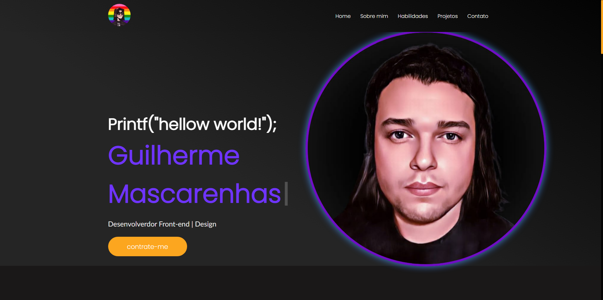

  <h1>Meu Portfólio 👦</h1>
  
  
  
  

     Este projeto é um site pessoal de portólio, para que os recrutadores possa analisar e entrar em contato comigo,
    de forma mais simples e dinamica. Nesse portfólio deixei meus principais projetos. Dividindo em duas divisões
    Design e Developer. Aproveitei e coloquei tudo que aprendi em react nesse tempo que estou estudando essa tecnologia.
  

  
  <h2>Tecnologias👩‍💻 </h2>
  
   
   
   
   

 

<a href="https://my-portfolio-guidev1.vercel.app">Acesar projeto 💻</a>
